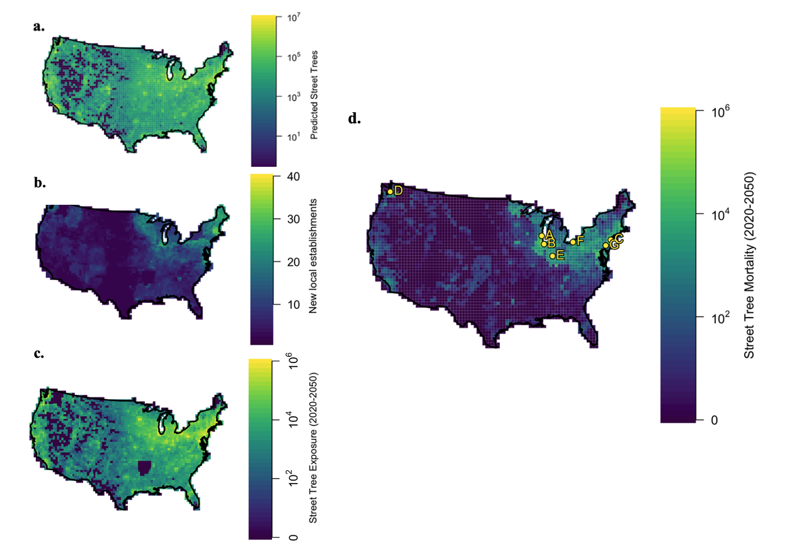

# Urban tree deaths from invasive pests in the United States from 2020-2050
---

_Authors: Emma J. Hudgins, Frank H. Koch, Mark J. Ambrose, and Brian Leung_

 Model outputs for the first three subcomponent models, including a. predicted street tree abundance, b. predicted newly invaded sites of existing IAFIs, c. predicted street tree exposure levels (number of focal host tree + IAFI interactions) from 2020 to 2050, and finally d. Predicted total tree mortality from 2020 to 2050 in the most likely mortality debt scenario across space. Top seven most impacted cities or groups of nearby cities are shown in terms of total tree mortality 2020 to 2050 (A = Milwaukee, WI; B = Chicago/Aurora/Naperville/Arlington Heights, IL; C = New York, NY; D = Seattle, WA; E = Warwick, RI, F = Philadelphia, PA; G = Indianapolis, IN). 

In this paper, we estimate the number of additional urban trees expected to die in the United States in the next 30 years due to the impacts of all known invasive forest pests.  

Urban trees are expected to be the target of the greatest economic impacts of forest pests, but previous impact estimates were at the country-level, and therefore lacked the necessary pest, tree, and spatiotemporal resolution to allow targeted management. In this study, we synthesized urban tree distributional models across 30,000 US communities with spread predictions for 57 pest species and host-specific estimates of tree death due to pest exposure.   

We estimate that an additional 1.5 million street trees will be killed by insects from 2020 through 2050, costing an annualized average of US$ 32M. However, these estimates hide substantial variation: 23% of urban centers will experience 94% of all insect-induced mortality, and 85% of all mortality will be due to emerald ash borer (Agrilus planipennis, EAB). We define an EAB high-impact zone spanning 902,500km2, largely within the Midwest and Northeast, within which we predict the death of 98.8% of all ash trees.  

“Mortality hotspot cities” facing costs of up to **13.0 million USD each** include **Milwaukee, WI, Indianapolis, IN, and Chicago, IL**.

We identify Asian wood borers of maple and oak trees as the highest risk future US urban tree insect invaders, where a new establishment could cost up to **4.3B USD** in the same time frame.

The predicted tree mortality/cost in each US community by tree genus is available in  "mortgrid.RDS/costgrid.RDS". For more finescale predictions, email emma.hudgins@mail.mcgill.ca  

## Implementation details

Written in R version 4.0.2 and rSTAN version 2.19.3

Read .RDS files into R using *readRDS()*.  

Reproduce results by loading R project (*UStreedamage.Rproj*) and running scripts in numerical order.  

## Scripts

### Scripts using private data (private_treedata_code subfolder)  

1. '01_totaltree_genusspecific_models.R'- fits total abundance and genus-specific abundance models for small, medium and large street trees
2. '02_extrapolate_models.R' - predicts genus-specific tree abundance in all US communities using the models fit in the previous scripts
3. '03_nonstreet_tree_models.R' - script used to calculate trees across all land use types using a smaller dataset for whole-community trees, which follows a same model selection approach to 01-02 (see MS), and get combined with street trees in synthesis'
3. 'totaltree_clean.R' - helper script to fits total tree models for small, medium and large street trees for use in script 01.
4. 'treemod_funcs.R' - helper functions used to assist in fitting street tree models

### Scripts using public data  

1. '010_beta_mortality_stan.R' - R script calling STAN model (./stan/beta_mort.stan) and saving output using latin hypercube sampling to show theoretical validity, and then fitting to pest severity data  
2. '02x_forecasted_presences_x.R',- forecasts pest spread based on Hudgins et al. 2017;2020 for pests present for more and less than to years with only a single occurrence timepoint (see Hudgins et al. 2020), as well as for 4 pest species with historical spread data (up to date for 2015, EAB up-to-date for 2020, data from USDA FS). '027_new_presences.R' combines all forecasts into one dataframe.
3. '030_tree_grid_public.R' - uses models produced in private folder to calculate trees in each grid cell in order to get matched to pest spread forecasts (which get converted back to community-level data in script 041).  
4. 	a. '040_model_synthesis.R' - synthesizes four model predictions into tree mortality and cost estimates by community  
	b. '041_eachcommunity.R' - extracts tree mortality and cost incurred by each US community in the most likely scenario  
	c. '042_plotting.R' - reproduces important plots from the manuscript  

### Derived data  

1. 'presences_time_noforce3.csv' - pest spread forecasts from Hudgins et al. (2020) Ecol. App.  
2. 'datanorm.csv' - pest data from Hudgins et al. 2017;2019  
3. 'grid_x.csv' - predicted trees in each grid cell, for street, residential (res), and non-residential (com) trees of each size class   
4. 'mortality_x.csv' - predicted mortality for each tree/grid cell/pest combination for each lag or the 
6. 'completepredictionset.rds' - predicted trees of 3 size classes of each genus, plus # expected to die due to each pest, in each community by PLACEFIPS code. Please email me if you are looking for a csv copy of this file.
7. 'hostgen_x.rds' - predicted asymptotic mortality for each pest/host combination

For any questions or suspected bugs, feel free to open an issue or email me at emma.hudgins@mail.mcgill.ca

